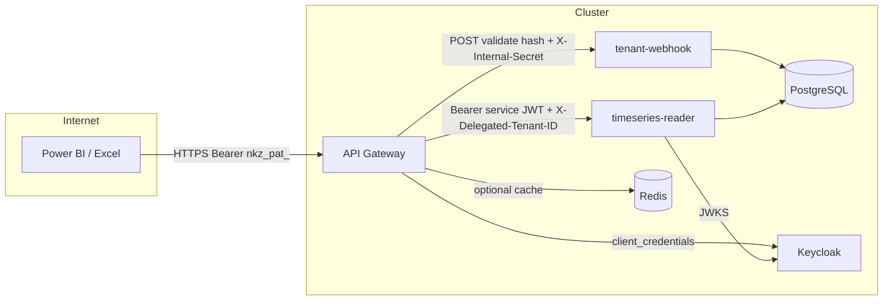

# ADR 003: PAT authentication and delegated identity (Zero Trust)

## Status

**Accepted** — implementation in progress (platform `nkz` + DataHub module UI).

## Context

- Platform API keys under `/api/admin/api-keys` are **PlatformAdmin-only** and not suitable for tenant users who need read-only analytics access from external tools.
- Validating PATs with a **database round-trip per request** on the API Gateway would harm latency for all traffic.
- **Symmetric shared secrets** between gateway and reader for “trust” are rejected in favour of **standard OAuth2 client credentials** and **Keycloak JWT validation** on the reader.

## Decision

### 1. Downstream authentication (timeseries-reader)

The reader **continues to validate JWTs with Keycloak JWKS** (no new symmetric crypto in the reader).

**Flow**

1. Client sends `Authorization: Bearer nkz_pat_…` to the public API Gateway on **timeseries routes only**.
2. Gateway validates the PAT (Redis, then optional HTTP to tenant-webhook; see below).
3. Gateway obtains a **short-lived access token** from Keycloak using **Client Credentials Grant** for client **`nkz-api-gateway`** (service account enabled).
4. Gateway forwards to `timeseries-reader-service`:
   - `Authorization: Bearer <Keycloak JWT from client credentials>`
   - `X-Delegated-Tenant-ID: <tenant resolved from PAT>` (after **stripping** any client-supplied `X-Delegated-Tenant-ID` on the ingress request)
   - `X-Tenant-ID` / `Fiware-Service` / `NGSILD-Tenant` set to the **same** delegated tenant for compatibility with existing headers.
5. **Reader** (`auth_middleware.require_auth`): if the JWT contains realm role **`urn:nkz:role:system-gateway`** in `realm_access.roles`, **ignore** end-user tenant claims and set tenant **only** from `X-Delegated-Tenant-ID` (normalized). **HMAC** is skipped for this path. For **all other** JWTs, **`X-Delegated-Tenant-ID` is ignored** for tenant resolution (spoofing protection).

**Keycloak (normative)**

| Item | Value |
|------|--------|
| Realm | Platform default (e.g. `nekazari`) |
| Client | **`nkz-api-gateway`** — new; **Service accounts** enabled |
| Client credentials | `GATEWAY_KEYCLOAK_CLIENT_ID` / `GATEWAY_KEYCLOAK_CLIENT_SECRET` from K8s Secret **`api-gateway-keycloak-secret`** |
| Realm role | **`urn:nkz:role:system-gateway`** assigned to the **service account** of `nkz-api-gateway` |
| Token claims | DevOps **must** configure a mapper so this role appears in **`realm_access.roles`** for client-credentials tokens (e.g. *User Realm Role* / realm role mapper). |

**Audience / `azp`**

- `validate_keycloak_token` in `common/keycloak_auth.py` allows **`nkz-api-gateway`** as an allowed audience / `azp` (via `GATEWAY_KEYCLOAK_CLIENT_ID`).

### 2. Scope (PAT allowed surfaces)

- PAT prefix **`nkz_pat_`** is handled **only** inside **`timeseries_proxy`** (`/api/timeseries/...`) in `fiware_api_gateway.py`.
- Any PAT presented to **other** routes (e.g. Orion `/api/entities`, admin) → **`401 Unauthorized`** (no PAT branch).

### 3. Token mechanics

| Topic | Decision |
|--------|-----------|
| **Internal validation** | `POST http://tenant-webhook-service:8080/internal/validate-pat` with JSON body `{"token_hash":"<hex>"}` only — **never** the raw PAT in logs or URLs. |
| **L7 protection** | Header **`X-Internal-Secret`** (shared secret from K8s; same value on gateway and webhook). |
| **Network** | Webhook is **ClusterIP** only; not exposed on public Ingress. |
| **Redis** | Gateway uses key `nkz:pat:hash:{sha256_hex}` → cached **tenant_id** string, TTL **300 s**. If Redis is **unavailable**, **degrade silently** to HTTP validation (no **503** solely for Redis). |
| **Revocation** | Eventual consistency: revoked PATs may work up to **TTL** (documented). No active Redis invalidation in v1. |
| **Entropy** | Raw secret: `nkz_pat_` + `secrets.token_urlsafe(32)`. |

### 4. Storage (PostgreSQL)

- Reuse **`api_keys`** with **`key_type = 'pat'`**.
- Migration adds **`created_by_sub`** (Keycloak `sub` of creator).
- **Lookup by hash** for validation uses a **`SECURITY DEFINER`** SQL function **`validate_pat_key_hash(text)`** so validation does not depend on RLS session tenant (hash is globally unique).

### 5. Tenant-facing API (tenant-webhook)

- **`GET/POST/DELETE /api/tenant/api-keys`** (PAT CRUD): JWT required; **`tenant_id` from token only**; ignore tenant in body for security.
- Proxied from browser via existing gateway route **`/api/tenant/<path>`** → webhook.

### 6. Frontend (DataHub module)

- Tab **“Integraciones”** in the DataHub IIFE bundle.
- Instruction URLs built from **`window.__ENV__.VITE_API_URL`** (no hardcoded production host).

### 7. Topology (K8s)

- **timeseries-reader**: **ClusterIP only**. **No** public Ingress to the reader. Single public entry: **API Gateway**.
- If a reader Ingress exists, it must be **removed** as part of this workstream.

### 8. Gateway hygiene

- Remove **duplicate** `get_request_token` in `fiware_api_gateway.py`; use **`common/keycloak_auth.get_request_token`** as the single source of truth.

---

## Threat model and trust boundaries

| Threat | Mitigation |
|--------|------------|
| PAT used on non-timeseries routes | Gateway rejects PAT outside `timeseries_proxy`. |
| Client spoofs `X-Delegated-Tenant-ID` with PAT | Gateway **strips** incoming header, then sets tenant from validated PAT only. |
| Client spoofs `X-Delegated-Tenant-ID` with normal user JWT | Reader **ignores** delegated header unless JWT has **`urn:nkz:role:system-gateway`** in `realm_access.roles`. |
| Stolen service-account JWT + arbitrary delegated tenant | Reader only reachable **from inside cluster** (ClusterIP); gateway is the sole ingress; protect gateway credentials and cluster network. |
| Compromised pod calls internal validate | **`X-Internal-Secret`** required; combine with network policies where feasible. |
| Raw PAT in internal traffic | Validate endpoint accepts **hash only** in JSON body. |

**Trust boundaries**

- **Public trust**: ends at the Gateway (TLS, rate limits, PAT/JWT rules).
- **Gateway ↔ Keycloak**: client secret; tokens are standard OAuth2 access tokens.
- **Gateway ↔ webhook (internal)**: ClusterIP + `X-Internal-Secret`.
- **Gateway ↔ reader**: ClusterIP; trust derived from **validated Keycloak JWT** + **strict role check** before honouring `X-Delegated-Tenant-ID`.

---

## Plan de Pruebas de Regresión (QA)

| Caso de Prueba | Ruta Destino | Credencial Enviada (Header/Cookie) | Cabeceras Maliciosas | Resultado Esperado (Gateway / Reader) |
|----------------|--------------|------------------------------------|----------------------|----------------------------------------|
| 1. Tráfico UI Normal | `/api/entities` (Orion) | JWT (`eyJ…`) o Cookie de sesión | Ninguna | 200 OK. Flujo inalterado. Gateway valida firma JWKS. |
| 2. Analítica Legítima | `/api/timeseries/v2/query` | PAT (`nkz_pat_…`) | Ninguna | 200 OK. Gateway valida PAT, cambia a JWT interno, Reader lee `X-Delegated-Tenant-ID`. |
| 3. PAT fuera de scope | `/api/entities` (Orion) | PAT (`nkz_pat_…`) | Ninguna | 401/403. Gateway bloquea la petición inmediatamente. PAT solo permitido en analítica. |
| 4. Spoofing Externo | `/api/timeseries/v2/query` | PAT (`nkz_pat_…`) | `X-Delegated-Tenant-ID: admin` | 200 OK (Aislado). Gateway debe hacer strip del header falso y sobreescribirlo con el tenant real del PAT. |
| 5. Spoofing Interno (UI) | `/api/timeseries/v2/query` | JWT Normal de Usuario (`eyJ…`) | `X-Delegated-Tenant-ID: admin` | 200 OK (Ignorado). Reader procesa la petición pero ignora el header falso porque el JWT no tiene el rol `urn:nkz:role:system-gateway`. Usa el tenant del JWT. |
| 6. Fallo de Redis | `/api/timeseries/v2/query` | PAT (`nkz_pat_…`) | Ninguna | 200 OK. Gateway degrada silenciosamente y valida contra el Webhook HTTP. |

---

## Operational secrets (K8s)

| Secret | Keys (example) | Consumers |
|--------|------------------|-----------|
| `api-gateway-keycloak-secret` | `client-id`, `client-secret` | api-gateway (`GATEWAY_KEYCLOAK_CLIENT_ID`, `GATEWAY_KEYCLOAK_CLIENT_SECRET`) |
| `pat-internal-secret` (name may vary) | `secret` | api-gateway + tenant-webhook (`INTERNAL_PAT_VALIDATE_SECRET`) |
| `redis-secret` | `password` | api-gateway (`REDIS_PASSWORD`) for PAT cache |

---

## Consequences

- **Positive**: No symmetric reader trust; standard Keycloak tokens; bounded PAT surface; cache reduces webhook/DB load.
- **Negative**: Operational dependency on Keycloak client + mappers; eventual consistency on revocation; DevOps must create Keycloak client and secrets before PAT works in production.

---

## References

- `nkz/services/common/keycloak_auth.py`
- `nkz/services/common/auth_middleware.py`
- `nkz/services/api-gateway/fiware_api_gateway.py`
- `nkz/services/tenant-webhook/enhanced-tenant-webhook.py`
- `nkz/config/timescaledb/migrations/063_pat_personal_access_tokens.sql`
- `nkz-module-datahub/docs/PLATFORM_TIMESERIES_INTEGRATION.md`
